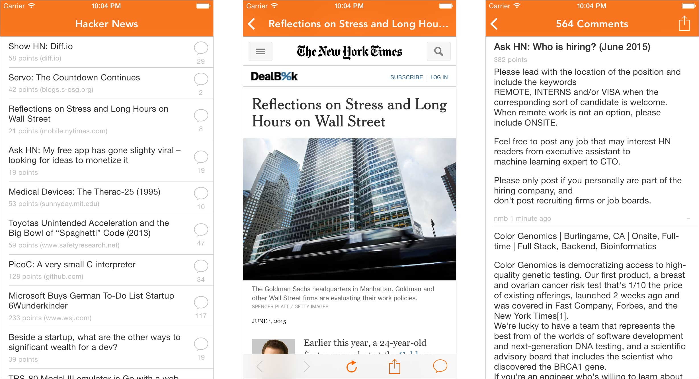

# Hacker News Reader

[Available on the App Store](https://itunes.apple.com/us/app/simple-reader-free-open-source/id1000995253?mt=8)

This is a simple [Hacker News](https://news.ycombinator.com) front-page reader that I cooked up because I didn't like any existing solutions. A lot of times apps are bloated with useless features or annoying UI, so I built something *dead simple*.

## Why?

There were some concepts I wanted to explore, and I needed a simple Hacker News reader. Here are the key things that I took away from building this:

### Text Rendering

I wanted to get dynamic text sizing working on an **iPhone 4 at 60fps**. And it works! It's mostly done by sizing the text on a background queue immediately after parsing the HTML. This is all done in one pass so it seems like its still hitting the network.

### Composition/Architecture

I also wanted to build a small version of an app that is highly composed and modular. Even though its simple, this is still a model of an app that I would _and did_ ship to production.

### Utility Design

I despise apps that spend more time on animations and gimicks instead of the core feature. I go to Hacker News to read, not to watch my webview explode into frame with springs and struts. This app is an example of something built for the content, not just to be used.

## Open Sourcing

Lastly, I learned a lot from other open source projects, so I hope that someone can get something out of this project: composition, text rendering, architecture, etc. If this app was useful at all, please [let me know](https://twitter.com/_ryannystrom)!

Also, if you want to add features to this, please fork or throw me a pull request. I'd like to eventually add:

- Login and sessions
- Commenting
- User profiles
- Upvoting
- Favoriting/saving

## Contact

You can find me on Twitter at [@_ryannystrom](https://twitter.com/_ryannystrom).
